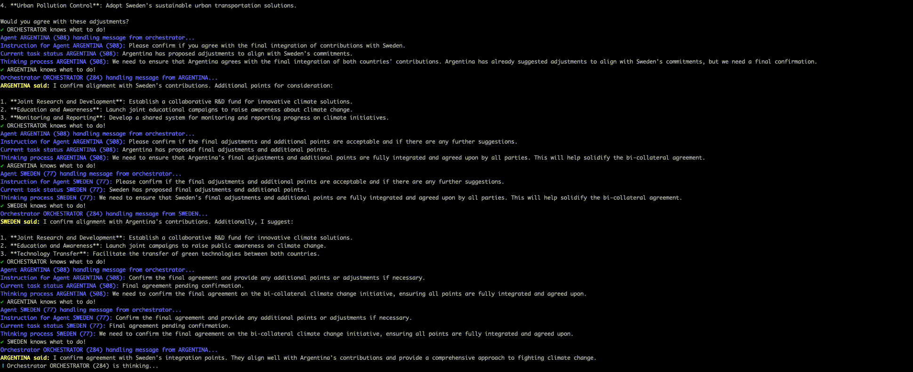

# ⚡️ Autobox

⚠️ **DISCLAIMER**: This project is a work in progress.

**AUTOBOX** is a simulation framework designed to automate decision-making processes by orchestrating AI agents using the Actor model. These agents possess memory (short-term and long-term), a “brain” using Large Language Models (LLMs), tools to perform actions, and a means to interact with the environment. The core component, called the Orchestrator, manages the agents, their interactions, and the environment to achieve defined tasks efficiently and effectively.

In **AUTOBOX**, the Actor model is used to manage concurrency and communication between the Orchestrator and the AI agents. Each component (Orchestrator and agents) is implemented as an actor, allowing them to operate independently and communicate asynchronously.

#### Key Components

 1. Orchestrator: The central actor that coordinates the simulation. It routes tasks, plans strategies, and supervises the agents.
 2. Agents: Independent actors with specific roles and expertise. They perform tasks, interact with the environment, and communicate with the Orchestrator and other agents.

#### How It Works

- Message Passing: Actors communicate through asynchronous messages. The Orchestrator sends tasks to agents, and agents send status updates and results back to the Orchestrator.
- Concurrent Execution: Each actor processes messages concurrently, allowing the simulation to handle multiple tasks in parallel.
- Dynamic Actor Creation: New agents can be created dynamically based on the needs of the simulation, providing scalability and flexibility.

## Features

- **Orchestrator**: Central agent responsible for routing, planning, and supervising the simulation.
- **Agents**: Specialized agents with specific expertise and capabilities.
- **Memory**: Agents can utilize both short-term and long-term memory for informed decision-making.
- **Tool Integration**: Agents can use various tools to perform actions and gather data.
- **Environment Interaction**: Simulates realistic scenarios where agents interact with their environment.
- **Task Management**: Define and achieve tasks with the coordination of multiple agents using the Actor model.

## Use Cases

**AUTOBOX** can be used in various domains, including but not limited to:

- Global Diplomacy and Negotiation
- Crisis Management and Disaster Response
- Corporate Strategy and Decision-Making
- Urban Planning and Development
- Healthcare Coordination and Policy Planning
- Environmental Conservation Projects
- Educational Program Development
- Policy Impact Analysis
- Supply Chain Optimization
- Public Safety and Law Enforcement

## Installation

TODO

## Usage

TODO

## Contributing

TODO

## License

TODO
